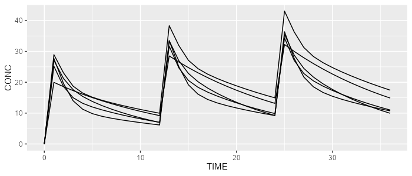

```{r, echo = FALSE}
knitr::opts_chunk$set(
  collapse = TRUE,
  comment = "#>",
  fig.path = "man/figures/"
)
```

# campsismod 

<!-- badges: start -->
[](https://github.com/Calvagone/campsismod/actions)
[](https://app.codecov.io/gh/Calvagone/campsismod)
<!-- badges: end -->

```{r, echo=FALSE, warning=FALSE, message=FALSE, results='hide'}
EXPORT_PNG <- FALSE
```
  
## Installation
Install the latest stable release using `devtools`:
  
```{r, eval=FALSE}
devtools::install_github("Calvagone/campsismod")
```

## Basic examples

### Load example from model library

Load 2-compartment PK model from built-in model library:

```{r message=FALSE}
library(campsismod)
model <- model_library$advan4_trans4
```

### Write CAMPSIS model

```{r message=FALSE, results='hide'}
model %>% write(file="path_to_model_folder")
```

```{r}
list.files("path_to_model_folder")
```

### Read and show CAMPSIS model

```{r}
model <- read.campsis(file="path_to_model_folder")
show(model)
```

### Simulate with RxODE or mrgsolve

```{r, eval=EXPORT_PNG}
library(campsis)

dataset <- Dataset(5) %>%
  add(Bolus(time=0, amount=1000, ii=12, addl=2)) %>%
  add(Observations(times=0:36))

rxode <- model %>% simulate(dataset=dataset, dest="RxODE", seed=1)
mrgsolve <- model %>% simulate(dataset=dataset, dest="mrgsolve", seed=1)
```

```{r, eval=EXPORT_PNG}
spaghettiPlot(rxode, "CP")
```

```{r, echo=FALSE, results='hide'}
file_vignette <- "vignettes/resources/results_rxode.png"
```

```{r, eval=EXPORT_PNG, echo=FALSE, results='hide'}
ggplot2::ggsave(filename=file_vignette, width=7, height=3, dpi=100)
```

```{r, echo=EXPORT_PNG, results='hide'}
file.copy(file_vignette, "docs/articles/resources/")
```



```{r, eval=EXPORT_PNG}
spaghettiPlot(mrgsolve, "CP")
```

```{r, echo=FALSE, results='hide'}
file_vignette <- "vignettes/resources/results_mrgsolve.png"
```

```{r, eval=EXPORT_PNG, echo=FALSE, results='hide'}
ggplot2::ggsave(filename=file_vignette, width=7, height=3, dpi=100)
```

```{r, echo=EXPORT_PNG, results='hide'}
file.copy(file_vignette, "docs/articles/resources/")
```

