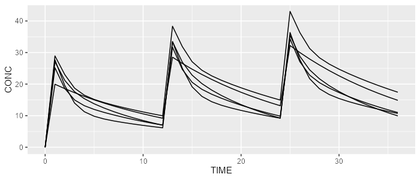
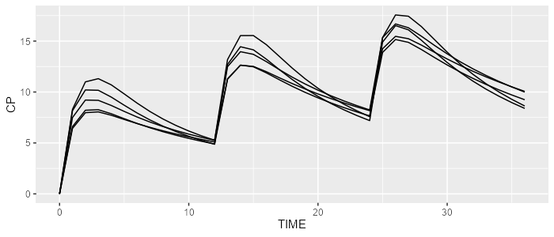

# campsismod 

<!-- badges: start -->

[](https://github.com/Calvagone/campsismod/actions)
[](https://app.codecov.io/gh/Calvagone/campsismod)
[](https://cran.r-project.org/package=campsismod)
[](https://cran.r-project.org/package=campsismod)
[](https://cran.r-project.org/package=campsismod)
<!-- badges: end -->

## Installation

Install the latest stable release using `devtools`:

``` r
devtools::install_github("Calvagone/campsismod")
```

## Basic examples

### Load example from model library

Load 2-compartment PK model from built-in model library:

``` r
library(campsismod)
model <- model_suite$pk$`2cpt_fo`
```

### Write Campsis model

``` r
model %>% write(file="path_to_model_folder")
```

``` r
list.files("path_to_model_folder")
#> [1] "model.campsis" "omega.csv"     "sigma.csv"     "theta.csv"
```

### Read and show Campsis model

``` r
model <- read.campsis(file="path_to_model_folder")
show(model)
#> [MAIN]
#> TVBIO=THETA_BIO
#> TVKA=THETA_KA
#> TVVC=THETA_VC
#> TVVP=THETA_VP
#> TVQ=THETA_Q
#> TVCL=THETA_CL
#> 
#> BIO=TVBIO
#> KA=TVKA * exp(ETA_KA)
#> VC=TVVC * exp(ETA_VC)
#> VP=TVVP * exp(ETA_VP)
#> Q=TVQ * exp(ETA_Q)
#> CL=TVCL * exp(ETA_CL)
#> 
#> [ODE]
#> d/dt(A_ABS)=-KA*A_ABS
#> d/dt(A_CENTRAL)=KA*A_ABS + Q/VP*A_PERIPHERAL - Q/VC*A_CENTRAL - CL/VC*A_CENTRAL
#> d/dt(A_PERIPHERAL)=Q/VC*A_CENTRAL - Q/VP*A_PERIPHERAL
#> 
#> [F]
#> A_ABS=BIO
#> 
#> [ERROR]
#> CONC=A_CENTRAL/VC
#> if (CONC <= 0.001) CONC=0.001
#> CONC_ERR=CONC*(1 + EPS_PROP_RUV)
#> 
#> 
#> THETA's:
#>   name index value   fix                            label unit
#> 1  BIO     1     1 FALSE                  Bioavailability <NA>
#> 2   KA     2     1 FALSE                  Absorption rate  1/h
#> 3   VC     3    10 FALSE    Volume of central compartment    L
#> 4   VP     4    40 FALSE Volume of peripheral compartment    L
#> 5    Q     5    20 FALSE           Inter-compartment flow  L/h
#> 6   CL     6     3 FALSE                        Clearance  L/h
#> OMEGA's:
#>   name index index2 value   fix type
#> 1   KA     1      1    25 FALSE  cv%
#> 2   VC     2      2    25 FALSE  cv%
#> 3   VP     3      3    25 FALSE  cv%
#> 4    Q     4      4    25 FALSE  cv%
#> 5   CL     5      5    25 FALSE  cv%
#> SIGMA's:
#>       name index index2 value   fix type
#> 1 PROP_RUV     1      1   0.1 FALSE   sd
#> No variance-covariance matrix
#> 
#> Compartments:
#> A_ABS (CMT=1)
#> A_CENTRAL (CMT=2)
#> A_PERIPHERAL (CMT=3)
```

### Simulate with rxode2 or mrgsolve

``` r
library(campsis)

dataset <- Dataset(5) %>%
  add(Bolus(time=0, amount=1000, ii=12, addl=2)) %>%
  add(Observations(times=0:36))

rxode <- model %>% simulate(dataset=dataset, dest="rxode2", seed=0)
mrgsolve <- model %>% simulate(dataset=dataset, dest="mrgsolve", seed=0)
```

``` r
spaghettiPlot(rxode, "CONC")
```

<figure>

<figcaption aria-hidden="true">rxode2 simulation results</figcaption>
</figure>

``` r
spaghettiPlot(mrgsolve, "CONC")
```

<figure>

<figcaption aria-hidden="true">mrgsolve simulation results</figcaption>
</figure>
