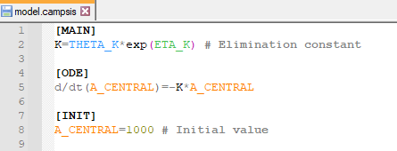
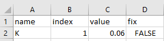
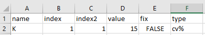
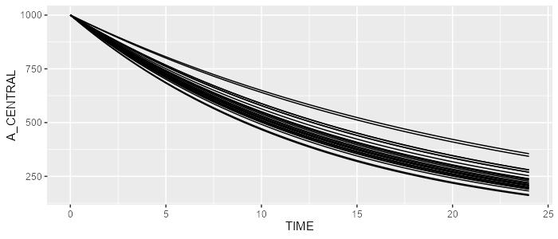
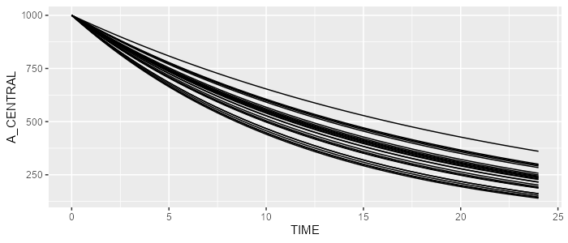

```{r, echo=FALSE, warning=FALSE, message=FALSE, results='hide'}
EXPORT_PNG <- FALSE
```

### Prerequisite

For this exercise, we'll need the `campsismod` package. This package can be loaded as follows:

```{r echo=TRUE, warning=FALSE, message=FALSE}
library(campsismod)
```

### Create a minimalist model in the Notepad++ editor

Assume a very simple 1-compartment PK model with first-order eliminate rate `K`. Say this parameter has a typical value of log(2)/12≈0.06 (where 12 is the elimination half life) and has 15% CV. Let's also initiate the central compartment to 1000.


This can be translated into the following CAMPSIS model (Notepad++ plugin can be downloaded here):


             
Let's now create our `theta.csv` with our single parameter `K` as follows:


           
And finally, let's also create our `omega.csv` to include inter-individual variability on `K`:


          
This model can now be loaded by `campsismod`...

```{r, eval=TRUE}
model <- read.campsis("resources/minimalist_model/")
```

Let's simulated this model in CAMPSIS:

```{r, eval=EXPORT_PNG}
library(campsis)
dataset <- Dataset(25) %>% add(Observations(seq(0,24,by=0.5)))
results <- model %>% simulate(dataset=dataset, seed=1)
spaghettiPlot(results, "A_CENTRAL")
```

```{r, eval=EXPORT_PNG, echo=FALSE, results='hide'}
ggplot2::ggsave(filename="resources/minimalist_example_sim1.png", width=7, height=3, dpi=100)
```



### Create the same model programmatically

The same model can be created programmatically. First, let's create an empty CAMPSIS model.

```{r}
model <- CampsisModel()
```

Then, let's define the equation of our model parameter `K`.

```{r}
model <- model %>% add(Equation("K", "THETA_K*exp(ETA_K)"))
```

We can add an ordinary differential equation as follows:

```{r}
model <- model %>% add(Ode("A_CENTRAL", "-K*A_CENTRAL"))
```

We can init the central compartment as well on the fly:

```{r}
model <- model %>% add(InitialCondition(compartment=1, "1000"))
```

Finally, let's define our `THETA_K` and `ETA_K`:

```{r}
model <- model %>% add(Theta("K", value=0.06))
model <- model %>% add(Omega("K", value=15, type="cv%"))
```

This model can simulated by CAMPSIS as well. Powerful, isn't it?

```{r, eval=EXPORT_PNG}
library(campsis)
dataset <- Dataset(25) %>% add(Observations(seq(0,24,by=0.5)))
results <- model %>% simulate(dataset=dataset, seed=2)
spaghettiPlot(results, "A_CENTRAL")
```

```{r, eval=EXPORT_PNG, echo=FALSE, results='hide'}
ggplot2::ggsave(filename="resources/minimalist_example_sim2.png", width=7, height=3, dpi=100)
```

