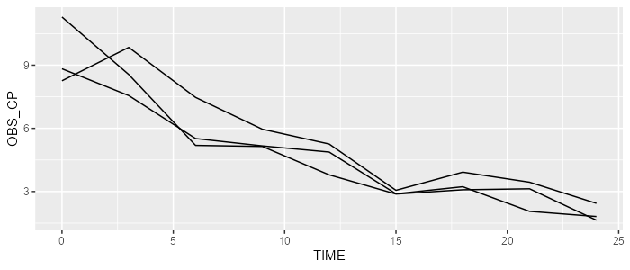

```{r, echo=FALSE, warning=FALSE, message=FALSE, results='hide'}
EXPORT_PNG <- FALSE
```

### Prerequisite

For this vignette, please load the `campsismod` package and load the minimalist model that we have created in the previous vignette.

```{r echo=TRUE, warning=FALSE, message=FALSE}
library(campsismod)
model <- read.campsis("resources/minimalist_model/")
```

### Define the concentration

A concentration is defined by the amount of drug present in the central compartment divided by the apparent volume of distribution.  
Let's now define the volume as a fixed constant of `100` in the model. This can be achieved as follows:

```{r}
model <- model %>% add(Equation("V", "100"))
model
```

By default, this new equation has been appended to the model parameters, in the `MAIN` code record.  

Now, we would like to define the plasma concentration. This can be done by adding an equation into the `ODE` code record. To do that, we'll use the argument `pos` to define the position of this equation. It can be inserted, for instance, right after the ordinary differential equation:

```{r}
model <- model %>% add(Equation("CP", "A_CENTRAL/V"), pos=Position(Ode("A_CENTRAL")))
model
```

### Define an error model

Say we want to add a proportional error model on the concentration with a coefficient of variation of 20%.  
We therefore need to add a new parameter SIGMA into the model:

```{r}
model <- model %>% add(Sigma("PROP", value=20, type="cv%"))
```

Then, we need to add a new `ERROR` code record with the appropriate equations:

```{r}
error <- ErrorRecord()
error <- error %>% add(Equation("OBS_CP", "CP*(1 + EPS_PROP)"))
model <- model %>% add(error)
model
```

### Simulate the observed concentration

Let's now simulate a few individuals and show `OBS_CP`.

```{r, eval=EXPORT_PNG}
library(campsis)
dataset <- Dataset(3) %>% add(Observations(seq(0,24,by=3)))
results <- model %>% simulate(dataset=dataset, seed=0)
spaghettiPlot(results, "OBS_CP")
```

```{r, eval=EXPORT_PNG, echo=FALSE, results='hide'}
ggplot2::ggsave(filename="resources/minimalist_example_obs_cp.png", width=7, height=3, dpi=100)
```



### A couple of useful functions in action

We can check the existence of an equation (or any other type of model statement), by calling the function `contains`.

```{r}
model %>% contains(Equation("CP"))

model %>% contains(Ode("A_CENTRAL"))
```

In the same way, we can retrieve any model statement easily using the function `find`:

```{r}
model %>% find(Equation("CP"))

model %>% find(Ode("A_CENTRAL"))
```

For instance, right-hand side formula of equation `CP` can be retrieved as follows:

```{r}
(model %>% find(Equation("CP")))@rhs
```

Any model statement may be replaced using the function `replace`:

```{r}
model %>% replace(Equation("V", "50")) # Previous value of 100 is overridden
```

Finally, model statements can also be deleted forever (making the model broken in the following case):

```{r}
model %>% delete(Equation("V"))
```