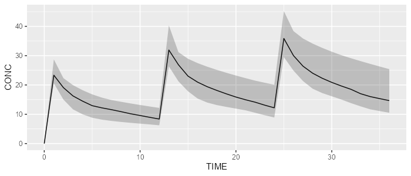
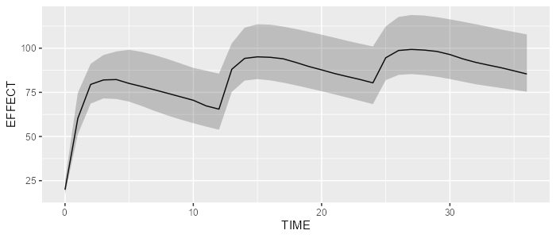

```{r, echo=FALSE, warning=FALSE, message=FALSE, results='hide'}
EXPORT_PNG <- FALSE
```

This vignette shows how a model can be appended to another. This is particularly useful when appending a PD model to a existing PK model. In this vignette, we'll demonstrate how an effect compartment model can be appended to a 2-compartment model.

### Prerequisite

The examples below require the package `campismod`.

```{r echo=TRUE, warning=FALSE, message=FALSE}
library(campsismod)
```

### Load your base PK model 

The following code will load our reference 2-compartment PK model.

```{r}
pk_model <- model_library$advan4_trans4
```

### Load an effect-compartment model

The effect-compartment model can be loaded from the model library as follows:

```{r echo=TRUE, warning=FALSE, message=FALSE}
pd_model <- model_library$effect_cmt_model
pd_model
```

This PD model has a variable `PK_CONC`, that needs to be linked with the PK concentration.  
Therefore, we need to adapt it as follows:

```{r}
pd_model <- pd_model %>% replace(Equation("PK_CONC", "A_CENTRAL/S2"))
```

### Append PD model to PK model

Appending the PD model to the PK model is done using the `add` function:

```{r}
pkpd_model <- pk_model %>% add(pd_model)
pkpd_model
```

### Simulate our PK/PD model

Let's now simulate our PK/PD model:

```{r, eval=EXPORT_PNG}
library(campsis)
dataset <- Dataset(25) %>% 
  add(Bolus(time=0, amount=1000, compartment=1, ii=12, addl=2)) %>%
  add(Observations(times=0:36))
results <- pkpd_model %>% simulate(dataset=dataset, seed=1)
shadedPlot(results, "CP")
```

```{r, eval=EXPORT_PNG}
shadedPlot(results, "CP")
```

```{r, eval=EXPORT_PNG, echo=FALSE, results='hide'}
ggplot2::ggsave(filename="resources/pkpd_model_concentration.png", width=7, height=3, dpi=100)
```



```{r, eval=EXPORT_PNG}
shadedPlot(results, "A_EFFECT")
```

```{r, eval=EXPORT_PNG, echo=FALSE, results='hide'}
ggplot2::ggsave(filename="resources/pkpd_model_effect.png", width=7, height=3, dpi=100)
```


